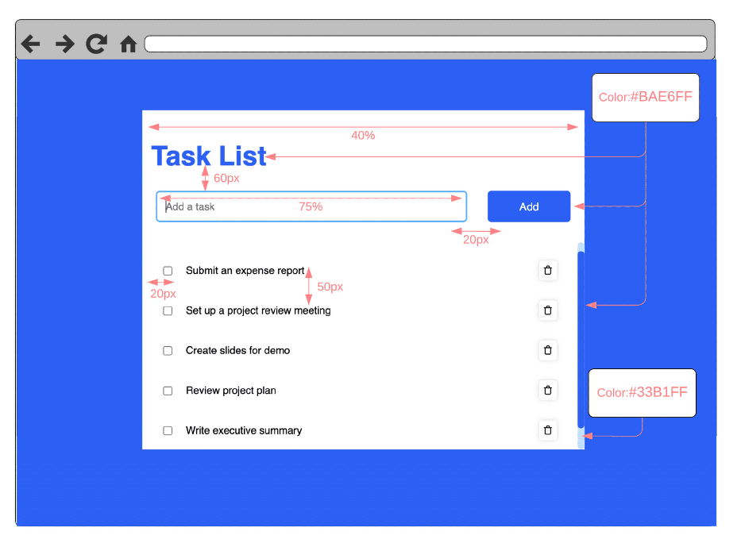
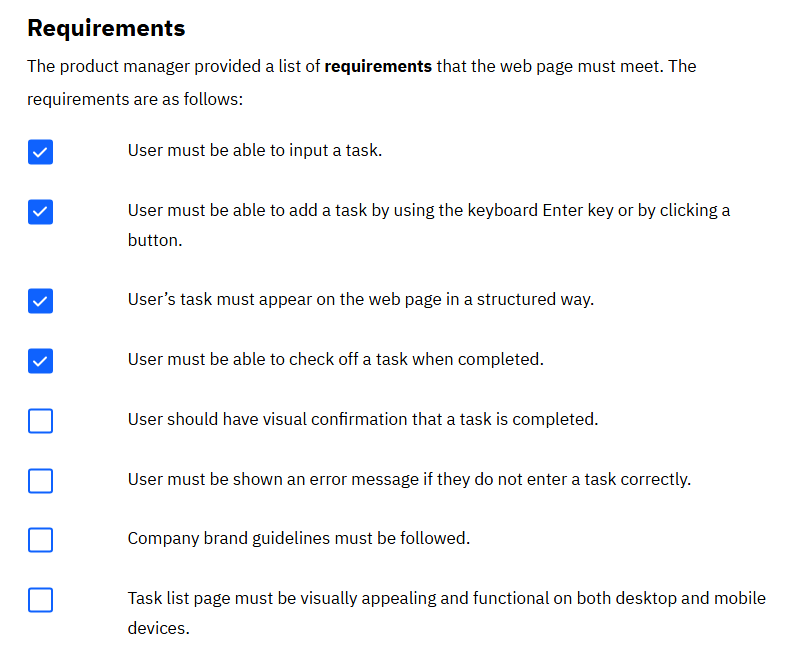
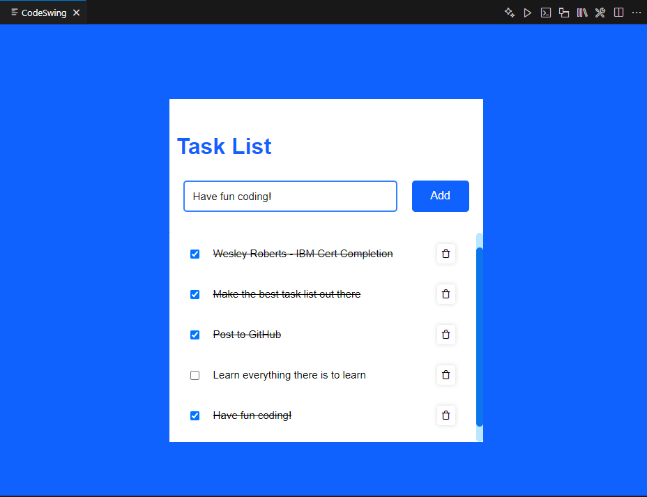

# IBMWebDevelopmentCert

## Introduction

Hello World! My name is Wesley Roberts and this is my completed project for my Web Development Fundamentals Certification. I had a lot of fun learning how to become a web developer and am excited to go create more projects on my own!

## WireFrame:

I was provided a wireframe with specifications on company color, expected visuals, and the overall look of what they wanted the web page to look like.

## Requirements:

I was also provide a list of functional requirements that the task list was expected to handle include checking off a task, removing tasks, adding tasks, and form fitting for desktop and mobile devices.

## Final Product:

I had 3 main files: Index.html, style.css, and script.js. Index.html handles the structure of the web page, style.css gives the constraints for the visual aspects, margins and paddings for the webpage (which is using a container), and script.js handles the functionality of th webpage. All of which are in clean and easy to read files of their own and easily updatable and maintainable. I used dev tools such as CodeSwing to be able to update the webpage in real-time and fully be able to see customizations during the entire process of development. The Task handler met all required functionality and nearly matched the specifications desired by the company perfectly. Overall, I learned a lot during this certifcation and am excited to use that knowledge on many more projects in the future. 

